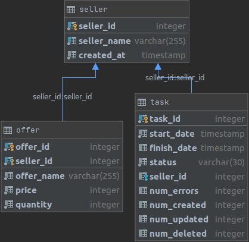

# Веб-сервис для загрузки товаров из файлов excel
## Общее описание

Приложение предоставляет API для регистрации продавцов и загрузки их товаров из excel файлов. Файла загружаются асинхронно, отдельными задачами с возможностью отслеживания их статуса. Сервис не поддерживает возобновление выполнения задач после сбоя, если сервис был остановлен, то после перезапуска все незавершенные задачи будут автоматически закрыты со статусом "Ошибка".

Приложение распространяется в виде композиции контейнеров docker:
- offers -- контейнер с веб-сервисом
- offers-postgres -- контейнер с СУБД postgresql

В случае обращения к несуществующему обработчику API сервис вернет `HTTP 404` и сообщение о ошибке:
```json
{
  "message": "not found"
}
```

В случае ображения к обработчику с помощью неподдерживаемого HTTP метода сервис вернет `HTTP 405` и сообщение о ошибке:
```json
{
  "message": "method not allowed"
}
```

При возникновении необработанной внутренней ошибки сервис (в большинстве случаев) возвращает `HTTP 500` и сообщение:
```json
{
  "message": "внутренняя ошибка сервера"
}
```

## Как запустить:
Загрузить  приложение из репозитория, перейти в директорию с приложением и запустить контейнеры командой docker-compose
```bash
git clone https://github.com/ZmiyProjects/localOffersLoader
cd localOffersLoader
docker-compose up
```

В результате сервис запустится в локальной сети на 0.0.0.0:8080.

## Запуск тестов

Для запуска теcтов необходимо зайти в контейнер оffers -- находясь в корневой директории проекта, выполнить: 
```bash
docker exec -it offers bash
```
Затем запустить тесты внутри контейнера
```bash
go test
```

Ограничения тестирования -- в процессе тестирования применяется основная база данных, отсутствует фикстура с тестовой БД. По этой причине БД должна оставаться пустой в момент запуска тестов и ее необходимо очистить после их завершения. Необходимо очищать и пересобирать контейнер перед (если в БД есть данные) и после запуска тестов. Текущий вариант -- решения для локального тестирования, он неприемлем для рабочей среды:

```bash
docker-compose down --volumes
docker-compose up
```
## Основные методы API

- ```POST /sellers```

Создание нового продавца. На входе ожидает JSON с наименованием продавца:
```json
{
  "seller_name": "Продавец"
}
```
Где seller_name -- не пустая строка, начинающаяся с символа кириллицы или латанницы.
При успешном выполнении вернет статус `HTTP 201` и JSON и идентификатором созданного продавца.
```json
{
  "seller_id": 1
}
```
Если на вход поступин некорректный seller_name, сервис вернет сообщение об ошибке и `HTTP 400`:
```json
{
  "message": "Неверный формат seller_name! Ожидается не пустая строка, начинающаяся с символа кириллицы или латанницы"
}
```
Сервис вернет ошибку и в случае если уже существует продавец с указанным названием:
```json
{
  "message": "Продавец с указанным SellerName уже существует!"
}
```

- ```GET /sellers```
  
Возвращает перечень всех зарегистрированных в системе продавцов в порядке возрастания даты регистрации. Вернет HTTP 200 и JSON с данными:
```json
{
  "sellers":[
    {
      "seller_id": 1,
      "seller_name": "Первый"
    },
    {
      "seller_id": 2,
      "seller_name": "Второй"
    }
  ]
}
```

- ```GET /sellers/{id}```

Возвращает зарегистрированного в системе продавца по идентификатору. При усперном выполнении возвращает `HTTP 200` и JSON с данными:
```json
{
  "seller_id": 1,
  "seller_name": "Первый"
}
```

Если продавец с указанным id не существует вернет `HTTP 400` и сообщение о ошибке:
```json
{
  "message":"Продавец с указанным SellerId не существует!"
}
```

- ```POST /sellers/{id}/offers/load```
 
На входе ошидается excel файл без заголовков, со следующими полями:

- offer_id - уникальный идентификатор товара в системе продавца
- name - название товара, не пустая строка
- price - цена в рублях, целое число, может быть равна 0 (товар бесплатный), но не отрицательной
- quantity - количество товара, не отрицательное целое число, должно быть больше 0.
- available - true/false, в случае false осуществляется удаление загруженного товара из базы. Указание false при первичной загрузке считается ошибкой.

Признанные некорректными строки не загружаются в базу, их число учитывается в поле num_errors задачи (task)
 
Обработчик осуществляет загрузку excel файла с товарами от имени продавца с указанным id. При успешном выполнении запустит задачу по загрузке данных из файла и вернет `HTTP 200` и идентификатор задачи для отслуживания ее статуса:
```json
{
  "task_id": 1
}
```
При попытке загрузки от лица несуществующего продавка сервис вернет `HTTP 400` и сообщение о ошибке:
```json
{
    "message": "Продавец с указанным SellerId не существует!"
}
```

Примечание -- если на вход подан некорректных файл, обработчик успешно отработает, сообщение от ошибке появится в статусе задачи (поле status).

- ```GET /tasks```

Получить статусы всех задач по загрузке excel файлов. Результат запроса отсортирован следующим образом по возрастанию start_date, но выполняющиеся в настоящий момент задачи выводятся в начале списка. Принимает на вход аргументы url -- limit (максимум выводимых записей) и offset (сколько записей будет пропущено). По умолчанию оба аргумента не указано, что соответствует выводу всех записей.  При успешном выполнении возвращает `HTTP 200` и JSON с данными:
```json
{
  "tasks": [
    {
      "task_id": 3,
      "start_date": "2021-01-11T22:26:22.606159Z",
      "finish_date": null,
      "status": "Выполняется",
      "num_errors": null,
      "num_created": null,
      "num_updated": null,
      "num_deleted": null,
      "seller": {
        "seller_id": 2,
        "seller_name": "Второй"
      }
    },

    {
      "task_id": 1,
      "start_date": "2021-01-11T22:25:21.567136Z",
      "finish_date": "2021-01-11T22:25:21.578896Z",
      "status": "Завершен",
      "num_errors": 0,
      "num_created": 0,
      "num_updated": 2,
      "num_deleted": 2,
      "seller": {
        "seller_id": 1,
        "seller_name": "Первый"
      }
    },
    {
      "task_id": 2,
      "start_date": "2021-01-11T22:25:22.606159Z",
      "finish_date": "2021-01-11T22:25:22.608317Z",
      "status": "Ошибка",
      "num_errors": null,
      "num_created": null,
      "num_updated": null,
      "num_deleted": null,
      "seller": {
        "seller_id": 1,
        "seller_name": "Первый"
      }
    }
  ]
}
```

Если агрументы limit и/или offset получили недопустимые значения (отрицательное значение или не число) - запрос завершится с ошибкой, вернет `HTTP 400` и сообщение:
```json
{
  "message": "недопустимое значение аргумента limit"
}
```

или

```json
{
  "message": "недопустимое значение аргумента offset"
}
```

- ```GET /tasks/{id}```

Вернуть конкретную задачу по идентификатору. При успешном выполнении При успешном выполнении возвращает `HTTP 200` и JSON с данными:

```json
{
  "task_id": 2,
  "start_date": "2021-01-11T23:52:23.402189Z",
  "finish_date": "2021-01-11T23:52:23.40504Z",
  "status": "Завершен",
  "num_errors": 3,
  "num_created": 2,
  "num_updated": 0,
  "num_deleted": 0,
  "seller": {
    "seller_id": 2,
    "seller_name": "Второй"
  }
}
```

Если задача с указанным id не найдена в базе, сервис вернет `HTTP 400` с сообщение о ошиюке:
```json
{
    "message": "Отсутствует задача с указанным TaskId!"
}
```

- ```GET /offers/search```

Осуществляет поиск по загруженным в базу товарам, использую следующие фильтры:
- offer_name - поиск по подстроке в названии товара
- seller_id - поиск по идентификатору продавца
- offer_id - поиск по идентификатору товара

Ни один фильтр не является обязательным, все фильтры применяются через логический оператор "И".

На входе ожидается JSON со следующими полями:
- offer_name - фильтр offer_name
- seller_id - фильтр seller_id
- offer_id - фильтр offer_id
- ignore_register - флаг, учитывать ли регистр при поиске по offer_name, false - регистр учитывается, true - регистр игнорируется. По умолчанию false.

Если ни 1 из фильтров не указан будут возвращены все внесенные в систему товары. Образец входных данных со всеми полями:

```json
{
  "offer_name": "домашний",
  "seller_id": 1,
  "offer_id": 9,
  "ignore_register": true
}
```

Образец входных данных для примера вывода:
```json
{
  "offer_name": "набор",
  "ignore_register": true
}
```

При успешном выполнении сервис вернет `HTTP 200` и JSON с данными:
```json
{
  "offers": [
    {
      "offer_id":6,
      "offer_name":"набор карандашей 8шт. (цветные)",
      "price":500,
      "quantity":9,
      "seller":{
        "seller_id":2,
        "seller_name":"Второй"
      }
    },
    {
      "offer_id":8,
      "offer_name":"Подарочный набор для рисования",
      "price":1800,
      "quantity":2,
      "seller": {
        "seller_id":2,
        "seller_name":"Второй"
      }
    }
  ]
}
```

## Устройство базы данных веб-сервиса


### seller
Сведения о продавцах

- seller_id - уникальный идентификатор продавца (PK);
- seller_name - уникальное наименования продавца;
- created_at - дата регистрации продавца в системе

### offer
Сведения о загруженных товарах от продавцов

- offer_id - уникальный в рамках продавца идентификатор товара (часть составного PK)
- seller_id - уникальный идентификатор продавца (часть составного PK и ссылка на seller)
- offer_name - название товара
- price - стоимость товара
- quantity - количество

### task 
Сведения о выполняемых системой задачах по загрузке excel файлов

- task_id - уникальный идентификатор задачи (PK)
- start_date - дата начала выполнения задачи
- дата окончания выполнения задачи
- status - статус задачи, допустимые значения -- Выполняется, Ошибка, Завершен
- seller_id - идентификатор продавца, для которого осуществляется загрузка данных
- num_errors - количество строк с ошибками
- num_created - количество загруженных в БД записей
- num_updated - количество обновленных записей
- num_deleted - количество удаленных записей